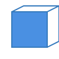
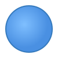
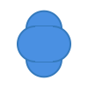

# MatterCAD Documentation

Welcome to the MatterCAD documentation. This guide provides an overview of all available shapes, transformations, and operations in the MatterCAD library.

## Shapes

### Box
Creates a rectangular box.
- **Constructors**:
  - `Box(double sizeX, double sizeY, double sizeZ, string name = "", bool createCentered = true)`
  - `Box(Vector3 size, string name = "", bool createCentered = true)`

### Cylinder
Creates a cylinder or cone.
- **Constructors**:
  - `Cylinder(double radius, double height, int sides, Alignment alignment = Alignment.z, string name = "")`
  - `Cylinder(double radius1, double radius2, double height, int sides, Alignment alignment = Alignment.z, string name = "")`

### Sphere
Creates a sphere.
- **Constructors**:
  - `Sphere(double radius, string name = "")`

### Torus
Creates a torus (donut shape).
- **Constructors**:
  - `Torus(double majorRadius, double minorRadius, int sides = 20, int segments = 20, string name = "")`

### NGonExtrusion
Creates an extrusion of a regular polygon.
- **Constructors**:
  - `NGonExtrusion(double radius1, double numSides, double height, Alignment alignment = Alignment.z, string name = "")`

### LinearExtrude
Extrudes a 2D shape along a linear path.
- **Constructors**:
  - `LinearExtrude(IEnumerable<Vector2> points, double height, string name = "")`

### RotateExtrude
Extrudes a 2D shape by rotating it around an axis.
- **Constructors**:
  - `RotateExtrude(IEnumerable<Vector2> points, int sides = 20, string name = "")`

### Round
Creates a box with rounded edges or corners.
- **Constructors**:
  - `Round(Vector3 size, string name = "")`
  - `Round(double xSize, double ySize, double zSize, string name = "")`
- **Methods**:
  - `RoundFace(Face faceToRound, double radius)`
  - `RoundEdge(Edge edgeToRound, double radius)`
  - `RoundPoint(Face threeFacesThatSharePoint, double radius)`
  - `RoundAll(double radius)`

---

## Transformations

### Translate
Moves an object in 3D space.
- **Example**: `new Translate(myObject, x: 10, y: 0, z: 5);`

### Rotate
Rotates an object around the X, Y, and Z axes.
- **Example**: `new Rotate(myObject, x: MathHelper.DegreesToRadians(45));`

### Scale
Changes the size of an object.
- **Example**: `new Scale(myObject, x: 2, y: 1, z: 1);`

### Align
Aligns one object to another based on their faces.
- **Example**: `new Align(objectToMove, Face.Left, targetObject, Face.Right);`

### SetCenter
Sets the center of an object to a specific position.
- **Example**: `new SetCenter(myObject, new Vector3(0, 0, 0));`

### Mirror
Mirrors an object across a plane.
- **Methods**:
  - `NewMirrorAccrossX(double offsetFromOrigin = 0)`
  - `NewMirrorAccrossY(double offsetFromOrigin = 0)`
  - `NewMirrorAccrossZ(double offsetFromOrigin = 0)`

---

## Operations (CSG)

### Union
Combines multiple objects into one.
- **C# operator**: `obj1 + obj2`

### Difference
Subtracts one object from another.
- **C# operator**: `obj1 - obj2`

### Intersection
Keeps only the overlapping part of two objects.
- **C# operator**: `obj1 & obj2` (or similar depending on implementation)

---

## Constants and Enums

### Alignment
Used to specify the primary axis of a shape.
- `Alignment.x`, `Alignment.y`, `Alignment.z`
- `Alignment.negX`, `Alignment.negY`, `Alignment.negZ`

### Face
Used for alignment and rounding.
- `Face.Left`, `Face.Right`, `Face.Front`, `Face.Back`, `Face.Bottom`, `Face.Top`

### Edge
Used for rounding edges.
- `Edge.LeftFront`, `Edge.LeftBack`, `Edge.LeftTop`, `Edge.LeftBottom`, etc.
